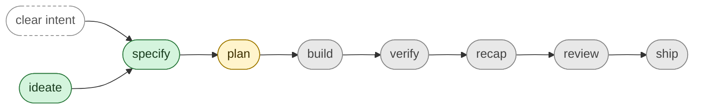

# SpecStudio Skills

The Claude Code skills that make up SpecStudio. Each skill owns one phase of the spec-driven development lifecycle and gates the next on a lint-clean SpecScore artifact.

For the product overview and install instructions, see the [repo README](../README.md). For the design philosophy these skills share, see [`shared/philosophy.md`](./shared/philosophy.md).

## Lifecycle

Each phase consumes the previous phase's lint-clean artifact and gates the next. Green = Shipped, yellow = Defined, gray = Roadmap. `specify` also accepts a clear buildable intent directly — `ideate` is skippable when the problem and scope are already obvious.

## Status

| Skill | Status | Purpose |
|---|---|---|
| [`ideate`](./ideate/SKILL.md) | Shipped | Refine raw ideas into lint-clean SpecScore Idea artifacts. |
| [`specify`](./specify/SKILL.md) | Shipped | Turn an approved Idea into a lint-clean SpecScore Feature with G/W/T acceptance criteria. |
| [`plan`](../spec/ideas/specstudio-plan-skill.md) | Defined | Turn an approved Feature into an ordered, AC-mapped Plan artifact. |
| `build` | Roadmap | Implement Plan tasks one at a time, gated on AC coverage. |
| `verify` | Roadmap | Run Rehearse tests against acceptance criteria; report coverage. |
| `recap` | Roadmap | Summarize what was built against what was specified; surface drift. |
| `review` | Roadmap | Multi-axis review of code against the Feature it claims to satisfy. |
| `ship` | Roadmap | Pre-launch checklist gated on verify + review passing. |

### Status definitions

- **Shipped** — Skill folder exists at `skills/<name>/` with a working `SKILL.md`. Usable today via Claude Code.
- **Defined** — No skill yet. A lint-clean `spec/ideas/<slug>.md` (or Feature) exists with an Approved status; the problem and recommended direction are written down. Next step: promote via `specify`, then implement.
- **Roadmap** — No skill, no Idea, no Feature. The name is reserved on the lifecycle list; scope is TBD. Next step: `ideate` it.

The status cell links to the most-precise artifact that exists for each skill (`SKILL.md` for shipped, the Idea file for defined, no link for roadmap).

## Skills

### `ideate` — Shipped

Refines raw, vague ideas into SpecScore Idea artifacts through structured divergent and convergent thinking.

- **Output:** lint-clean `spec/ideas/<slug>.md` with Problem Statement, Recommended Direction, Alternatives Considered, MVP Scope, Not Doing, Key Assumptions, Open Questions.
- **Triggers:** `ideate`, `/ideate`, "refine this idea", "stress-test this".
- **Gate:** Does not invoke `specify`, `writing-plans`, or any implementation skill until the Idea is lint-clean and user-approved.
- **Source:** [`ideate/SKILL.md`](./ideate/SKILL.md)

### `specify` — Shipped

Turns an approved Idea (or a clear buildable intent) into a SpecScore Feature with requirements and `Given / When / Then` acceptance criteria.

- **Output:** lint-clean `spec/features/<slug>/` containing the Feature, requirements, ACs, and optional Rehearse test stubs.
- **Triggers:** `specify`, `/specify`, "spec this out", or the `idea.approved` Synchestra event.
- **Gate:** No code, plans, or scaffolding until the Feature is lint-clean and user-approved.
- **Source:** [`specify/SKILL.md`](./specify/SKILL.md)

### `plan` — Defined

Turns an approved Feature into an ordered set of tasks where each task references one or more AC IDs from its source Feature. Closes the gap where users today fall back to SpecScore-blind planning skills.

- **Planned output:** lint-clean `spec/plans/<slug>.md` of ordered, AC-mapped tasks.
- **Planned gate:** mirrors `ideate` and `specify` — lint-clean output and user approval before any `build` or implementation skill can run.
- **Status:** Idea approved 2026-04-20. Not yet promoted to a Feature.
- **Idea:** [`spec/ideas/specstudio-plan-skill.md`](../spec/ideas/specstudio-plan-skill.md)
- **Next step:** run `specstudio:specify` on the Idea to produce a Feature, then implement.

### `build` — Roadmap

The skill that consumes a Plan and writes code one task at a time, mapping each commit back to AC IDs.

Scope TBD. Next step: `ideate` it.

### `verify` — Roadmap

The skill that runs the Feature's Rehearse tests and reports per-AC pass/fail coverage.

Scope TBD. Next step: `ideate` it.

### `recap` — Roadmap

The skill that summarizes what was actually built against what was specified, surfacing spec↔code drift before review.

Scope TBD. Next step: `ideate` it.

### `review` — Roadmap

The skill that does multi-axis code review of an implementation against the Feature it claims to satisfy.

Scope TBD. Next step: `ideate` it.

### `ship` — Roadmap

The skill that runs the pre-launch checklist, gated on `verify` and `review` having passed.

Scope TBD. Next step: `ideate` it.

## `shared/`

Not a skill. [`shared/`](./shared/) holds cross-cutting reference material the SKILL.md files load on demand: the philosophy, path conventions, lint rules, the Synchestra event vocabulary, the Rehearse heuristic, and the question cadence. Treat these as the kit every skill imports from, not as something a user invokes.
