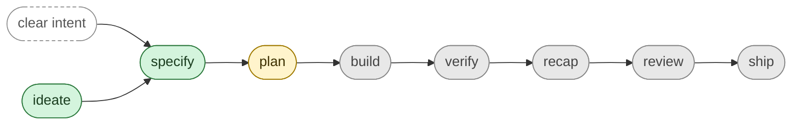

# Feature: Skills

> [View in SpecStudio](https://specstudio.synchestra.io/project/features?id=specstudio-skills@synchestra-io@github.com&path=spec%2Ffeatures%2Fskills) — graph, discussions, approvals

**Status:** Approved

## Summary

SpecStudio ships as a set of Claude Code skills, one per phase of the spec-driven development lifecycle. This feature is the umbrella for the per-skill sub-features that specify each skill's purpose, gates, inputs, outputs, and place in the lifecycle.

## Contents

| Directory | Description |
|---|---|
| [`ideate/`](ideate/README.md) | Refine raw ideas into lint-clean SpecScore Idea artifacts. |
| [`specify/`](specify/README.md) | Turn an approved Idea (or a clear buildable intent) into a SpecScore Feature with G/W/T acceptance criteria. |
| [`plan/`](plan/README.md) | Turn an approved Feature into an ordered, AC-mapped Plan artifact. |
| [`build/`](build/README.md) | Implement Plan tasks one at a time, mapping each commit back to AC IDs. |
| [`verify/`](verify/README.md) | Run a Feature's Rehearse tests and report per-AC coverage. |
| [`recap/`](recap/README.md) | Summarize what was built against what was specified; surface spec↔code drift. |
| [`review/`](review/README.md) | Multi-axis code review of an implementation against the Feature it claims to satisfy. |
| [`ship/`](ship/README.md) | Pre-launch checklist gated on `verify` and `review` having passed. |

### ideate

The `specstudio:ideate` skill produces a lint-clean `spec/ideas/<slug>.md` through structured divergent and convergent thinking. It is the entry point for any non-trivial concept and gates `specify` until the Idea is approved by the user.

### specify

The `specstudio:specify` skill produces a lint-clean SpecScore Feature at `spec/features/<slug>/`. It accepts either an approved Idea or a clear buildable intent — `ideate` is skippable when the problem and scope are already obvious.

### plan

The `specstudio:plan` skill is intended to produce a lint-clean `spec/plans/<slug>.md` of ordered tasks where each task references one or more AC IDs from its source Feature. Currently scoped as an Approved Idea (`specstudio-plan-skill`), not yet implemented.

### build

The `build` skill is intended to consume a Plan and write code one task at a time, mapping each commit back to the AC IDs the task claims to satisfy. Scope not yet defined — first step is to `ideate` it.

### verify

The `verify` skill is intended to run a Feature's Rehearse test scenarios and report per-AC pass/fail coverage, gating downstream skills on green tests. Scope not yet defined — first step is to `ideate` it.

### recap

The `recap` skill is intended to summarize what was actually built against what was specified, surfacing spec↔code drift before review. Scope not yet defined — first step is to `ideate` it.

### review

The `review` skill is intended to perform multi-axis code review (correctness, readability, architecture, security, performance) of an implementation against the Feature it claims to satisfy. Scope not yet defined — first step is to `ideate` it.

### ship

The `ship` skill is intended to run the pre-launch checklist, gated on `verify` and `review` having passed. Scope not yet defined — first step is to `ideate` it.

## Problem

SpecStudio's value proposition is spec↔code coherence: every skill produces an artifact that the next skill consumes, gated by `specscore lint`. For that loop to be machine-verifiable, each skill needs a typed Feature spec — not just a SKILL.md manifest and a roadmap line in the repo README. Without per-skill Features:

- Tooling cannot validate that a skill's behavior matches its specification.
- Contributors cannot tell where a skill is in its lifecycle (Draft / In Progress / Stable / Deprecated).
- The `Source Ideas` linkage from Features back to Approved Ideas has nowhere to live.

This umbrella feature establishes the directory structure under `spec/features/skills/` and the convention that each skill is a sub-feature of `skills`.

## Behavior

### Sub-feature per skill

Each Claude Code skill in the plugin's `skills/` directory is represented as a sub-feature under `spec/features/skills/<skill-id>/`. The skill folder's `README.md` back-links to its Feature, and the Feature's `README.md` documents the skill's purpose, gates, and lifecycle position.

### Status reflects spec maturity, not implementation maturity

The status column in this Feature's Contents table (and on each sub-feature) reflects how complete the **specification** is, not whether the skill is shipped. A skill that is implemented but whose Feature has not been formally specified is `Draft`. A skill whose Feature has been fully specified and reviewed is `Approved`. Once code is being written from the spec, status becomes `Implementing`. When the spec is locked and changes go through Proposals, it reaches `Stable`. The implementation status of each skill is tracked separately in [`skills/README.md`](../../../skills/README.md).

### Lifecycle ordering

Sub-features are listed in lifecycle order (`ideate` → `specify` → `plan` → `build` → `verify` → `recap` → `review` → `ship`):

This diagram is duplicated from [`skills/README.md`](../../../skills/README.md) so the lifecycle is visible from either entry point. **Color encodes implementation status, not spec status** — green = Shipped, yellow = Defined, gray = Roadmap. Each sub-feature's own `**Status:**` field (Draft / In Progress / Stable / Deprecated) reflects its specification maturity. `specify` accepts a clear buildable intent directly; `ideate` is skippable when the problem and scope are already obvious.

## Acceptance Criteria

Not defined yet.

## Outstanding Questions

- Acceptance criteria not yet defined for this feature.
- Should sub-feature status roll up to this parent? (e.g., once all sub-features reach `Stable`, does `skills` become `Stable`?)
- Does every future skill belong under `spec/features/skills/`, or are some skills (e.g., shared utilities, hooks) better expressed as sibling features?
- How do we represent the `shared/` directory under `skills/` — as a sub-feature, as a sibling reference feature, or as documentation only?

---
*This document follows the https://specscore.md/feature-specification*
